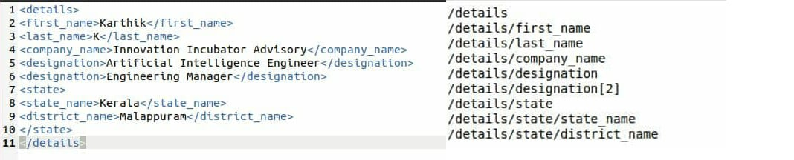

# X_path-Generator-for-ElementTree


## Problem Definition

Python ElementTree package doesn't provide a readily availabe function for XPath generation. The aim of this project is to introduce a fully fledged function that will generate the xpath of each child node correctly for the given XML in a short and crisp manner. This code is an additional feature for ElementTree to generate the XPath in less than 50 Lines. 


## How to Run?
```
python3 x_path_elementree.py

```

To execute with a custom XML run:

``` 
python3 x_path_elementree.py --xml <path to XML>

```

Jupyter Notebook Version is also Availiable.


## Test Results
### Demo1
<p align="center">
  
</p> 

